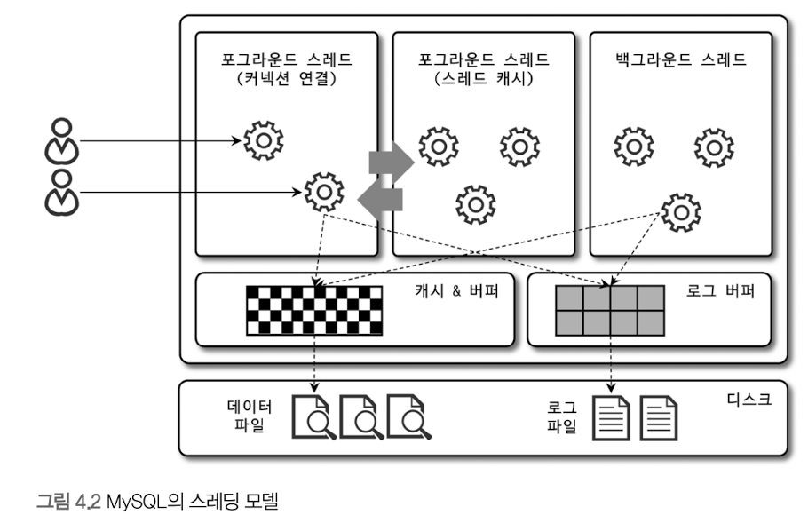

# Real MySQL
- [4. 아키텍처](#4-아키텍처)

# 4. 아키텍처
## MySQL 아키텍처
### MySQL 전체 구조

- MySQL 서버
    - MySQL 서버에서 MySQL 엔진은 하나지만, 스토리지 엔진은 여러 개를 동시에 사용할 수 있음
    - MySQL 엔진: 요청된 SQL 문장을 분석하거나 최적화하는 등 두뇌에 해당하는 처리를 수행
        - 커넥션 핸들러: 클라이언트로부터의 접속 및 쿼리 요청을 처리
        - SQL 파서
        - 옵티마이저
        - 전처리기
    - 스토리지 엔진: 실제 데이터를 디스크 스토리지에 저장하거나, 디스크 스토리지로부터 데이터를 읽어옴
        - 성능 향상을 위해 키 캐시(MyISAM)나 InnoDB 버퍼 풀(InnoDB)과 같은 기능 내장
    - 핸들러 API:
        - 핸들러 요청: MySQL 엔진의 쿼리 실행기에서 데이터 R/W 시 각 스토리지 엔진에 R/W 요청

### MySQL 스레딩 구조

MySQL 서버는 프로세스 기반이 아닌 스레드 기반 작동

프로세스 vs 스레드 다시 보기

- 프로세스: 메모리에 올라와 실행되고 있는 프로그램의 인스턴스, OS로부터 시스템 자원을 할당받는 작업의 단위
    - 각각 독립된 메모리 영역 ( Code, Data, Stack, Heap )을 할당 받음
    - 기본적으로 프로세스 당 최소 1개의 스레드를 가짐 ( 메인 스레드 )
    - 각 프로세스는 별도의 주소 공간에서 실행, 한 프로세스는 다른 프로세스의 변수나 자료구조에 접근할 수 없음
    - 다른 프로세스의 자원에 접근하려면 프로세스 간 통신(IPC, Inter-Process Communication)을 사용해야 함
        - ex. 파이프, 파일, 소켓
- 스레드: 프로세스 내에서 실행되는 여러 흐름의 단위, 프로세스가 할당받은 자원을 이용하는 실행의 단위
    - 프로세스 내에서 Stack만 따로 할당받고, Code, Data, Heap 영역은 공유
    - 프로세스 내의 주소 공간이나 자원들을 같은 프로세스 내 스레드끼리 공유
    - 한 스레드가 프로세스 자원을 변경하면, 다른 이웃 스레드도 그 변경 결과를 즉시 볼 수 있음

- 포그라운드 스레드(클라이언트 스레드)
    - 최소한 MySQL 서버에 접속된 클라이언트의 수만큼 존재
    - 주로 클라이언트가 요청하는 쿼리 문장을 처리
    - 클라이언트가 작업을 마치고 커넥션을 종료하면, 그 커넥션을 담당하던 스레드는 다시 스레드 캐시로 돌아감
        - 일정 개수 이상 스레드가 스레드 캐시에 대기하고 있으면, 스레드 캐시에 넣지 않고 종료시켜서 일정 개수의 스레드만 스레드 캐시에 존재하도록 함
    - 데이터를 데이터 버퍼나 캐시로부터 가져옴, 버퍼나 캐시에 없는 경우에는 직접 디스크의 데이터나 인덱스 파일에서 읽어와서 처리
- 백그라운드 스레드
    - InnoDB의 경우, 여러 작업이 백그라운드로 처리
        - 인서트 버퍼 병합
        - 로그를 디스크로 기록
        - InnoDB 버퍼 풀의 데이터를 디스크에 기록
        - 데이터를 버퍼로 읽어옴
        - 잠금이나 데드락 모니터링
    - 사용자 요청 처리 시, 읽기는 지연될 수 없지만 쓰기는 지연 처리 가능
        - InnoDB도 이런 방식으로 처리

### 메모리 할당 및 사용 구조

- 글로벌 메모리 영역
    - MySQL 서버가 시작되면서 OS로부터 메모리 공간 할당됨
    - 일반적으로 클라이언트 스레드 수와 무관하게 하나의 메모리 공간만 할당됨
    - 필요 시 여러 메모리 공간을 할당받을 수는 있지만, 모든 스레드에 의해 공유됨
- 로컬 메모리 영역 ( 세션 메모리 영역 )
    - 클라이언트 스레드가 쿼리를 처리하는 데에 사용하는 메모리 영역
    - 각 클라이언트 스레드 별 독립적으로 할당, 절대 공유되어 사용되지 않음
    - 각 쿼리의 용도별로 필요할 때만 공간이 할당, 필요하지 않은 경우에는 메모리 공간을 할당조차 하지 않을 수 있음

### 플러그인 스토리지 엔진 모델
사용자의 요구 조건을 만족하기 위해 부가적인 기 능을 제공하는 스토리지 엔진이 필요할 수 있음

데이터 R/W 작업 처리 방식이 얼마나 달라질 수 있는가

### 컴포넌트
플러그인의 단점 보완
-  플러그인은 MySQL 서버와만 인터페이스 할 수 있고, 플러그인끼리는 통신 불가
- 플러그인은 MySQL 서버의 변수나 함수 직접 호출 -> 안전하지 않음 ( 캡슐화 X )
- 플러그인은 상호 의존 관계를 설정할 수 없어 초기화 어려움

### 쿼리 실행 구조

- 쿼리 파서
    - 쿼리 문장을 토큰으로 분리해 트리 구조로 만들어냄
    - 기본 문법 오류는 이 과정에서 발견
- 전처리기
    - 파서 트리 기반으로 쿼리 문장에 구조적 문제가 있는지 확인
    - 실제 존재하지 않거나 권한상 사용할 수 없는 개체의 토큰은 이 단계에서 걸러짐
- 옵티마이저
    - 쿼리를 어떻게 저렴한 비용으로 가장 빠르게 처리할지 결정
- 실행 엔진
    - 만들어진 계획대로 각 핸들러에게 요청해서 받은 결과를 또 다른 핸들러 요청의 입력으로 연결
- 핸들러 ( 스토리지 엔진 )
    - 실행 엔진의 요청에 따라 데이터를 디스크로 저장하고 디스크로부터 읽음

### 쿼리 캐시
- SQL의 실행 결과를 메모리에 캐시, 동일 SQL 쿼리가 실행되면 즉시 결과 반환 가능
- 데이터가 변경되면 변경된 테이블 관련은 모두 삭제 필요 -> 동시 처리 성능 저하, 버그 원인
- MySQL 8.0 부터 쿼리 캐시는 제거됨

### 스레드 풀
- 내부적으로 사용자의 요청을 처리하는 스레드 개수를 줄여서 동시 처리되는 요청이 많더라도 CPU가 제한된 개수의 스레드 처리에만 집중할 수 있게 해서 서버의 자원 소모를 줄임

### 트랜잭션 지원 메타데이터
- 기존 파일 기반 메타데이터는 트랜잭션 지원하지 않기 때문에 데이터가 일관되지 않은 상태로 남는 문제가 있음
- MySQL 8.0 부터 테이블 구조 정보, 스토어드 프로그램 코드 모두 InnoDB 테이블에 저장