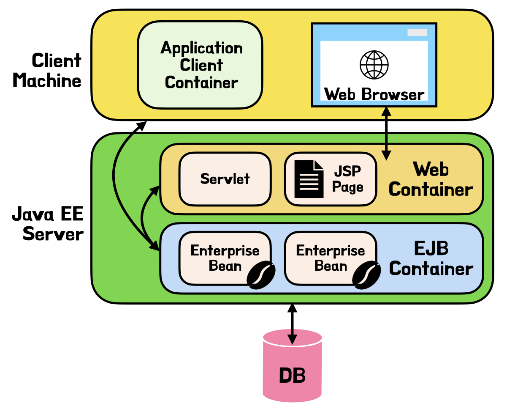

# 토비의 스프링 3.1 Vol.1
- Vol.1
    - [1. 오브젝트와 의존관계](#1-오브젝트와-의존관계)
    - [2. 테스트](#2-테스트)
    - [3. 템플릿](#3-템플릿)
    - [4. 예외](#4-예외)
    - [5. 서비스 추상화](#5-서비스-추상화)
    - [6. AOP](#6-aop)
    - [7. 스프링 핵심 기술의 응용](#7-스프링-핵심-기술의-응용)
    - [8. 스프링이란 무엇인가?](#8-스프링이란-무엇인가)
    - [9. 스프링 프로젝트 시작하기](#9-스프링-프로젝트-시작하기)

# 1. 오브젝트와 의존관계
## DAO의 분리
객체 지향 기술은 추상세계 자체를 효과적으로 구성하고, 변경, 발전, 확장시킬 수 있다는 점에 의미가 있음
    -> 변화에 어떻게 대비할 것인가가 가장 중요
    => **분리**와 **확장**을 고려해서 설계해야 함

### 관심사의 분리
관심이 같은 것은 모이게 하고, 관심이 다른 것은 떨어져서 영향을 주지 않도록 분리

1. 관심사항 파악
    * 책의 예시의 경우, UserDao 의 관심사항 정리
2. 중복 코드의 메소드 추출
    * DB의 변경 등으로 코드 수정이 필요할 경우, 추출한 메소드 한 개만 변경해도 이슈 없도록 중복 코드 분리
3. 변경 사항 검증 - 리팩토링과 테스트
    * 리팩토링 : 기존의 코드를 외부의 동작 방식에는 변화 없이, 내부 구조를 변경해서 재구성하는 작업

### 상속을 통한 확장
사용처에서 자유롭게 변화가 가능하도록 하는 코드 작성

#### 디자인 패턴
* 설계 시 자주 만나는 문제를 해결하기 위해 사용할 수 있는 재사용 가능한 솔루션
* 대부분 클래스 상속 또는 오브젝트 합성의 구조로 확장성 추구
* 예시
    * 템플릿 메소드 패턴 : 슈퍼클래스에 기본 로직 흐름을 만들고, 기능의 일부를 추상 메소드나 protected 메소드로 생성 후 서브클래스에서 구현해서 사용하는 패턴
    * 팩토리 메소드 패턴 : 서브클래스에서 구체적인 오브젝트 생성 방법을 결정하게 하는 패턴

#### 상속의 한계점
* 다중상속 불가능 : 한 번 상속을 하면, 추후 다른 목적을 위한 상속이 불가능
* 클래스 간 밀접한 관계 : 서브클래스가 슈퍼클래스의 기능을 직접 사용 -> 슈퍼클래스 내부 변경이 서브클래스에 영향을 미침
* 서브클래스들의 코드 중복 : 한 슈퍼클래스를 상속하는 서브클래스가 많아지면, 상속을 통해 만들어진 구현 코드가 모든 서브클래스마다 중복

## DAO의 확장
클래스 사이의 불필요한 의존관계를 제거해야 함
    - 예시의 UserDao 내에 DB 커넥션을 만드는 코드가 있거나, ConnectionMaker 구현체를 지정하는 것은 불필요한 의존관계가 생기는 것
    - UserDao 안이 아닌, 외부에서 UserDao가 사용할 Connection Maker 구현체를 지정하여 주입해줘야 함

### 원칙과 패턴
객체지향 설계 원칙 (SOLID)
- 단일 책임 원칙 (SRP : SIngle Responsibility Principle)
- 개방 폐쇄 원칙 (OCP : Open-Closed Principle)
    - 클래스나 모듈은 확장에는 열려 있어야 하고 변경에는 닫혀 있어야 한다
    - 높은 응집도 : 하나의 모듈, 클래스가 하나의 책임, 관심사에만 집중
    - 낮은 결합도 : 책임, 관심사가 다른 오브젝트 또는 모듈 간에는 느슨하게 연결
- 리스코프 치환 원칙 (LSP : Liskov Substitution Principle)
- 인터페이스 분리 원칙 (ISP : Interface Segregation Principle)
- 의존관계 역전 원칙 (DIP : Dependency Inversion Principle)

전략 패턴 : 변경이 필요한 알고리즘은 인터페이스를 통해 외부로 분리, 그 구현체를 필요에 따라 바꿔 사용할 수 있도록 함

## 제어의 역전 (IoC)
### 팩토리
- 객체 생성 방법을 결정하고, 생성된 오브젝트를 돌려주는 것
- 오브젝트 생성자, 사용자 분리 목적

### 제어관계 역전
- 자신이 사용할 오브젝트를 직전 선택하지도, 생성하지도 않음
- 제어의 권한을 다른 대상에게 위임

## 스프링의 IoC
### 빈
스프링이 제어권을 가지고 있는 오브젝트

### 빈 팩토리
빈의 생성과 관계 설정 등의 제어를 담당하는 IoC 오브젝트
스프링 IoC 담당하는 핵심 컨테이너

### 애플리케이션 컨텍스트
일종의 빈 팩토리 (빈 팩토리를 확장한 IoC 컨테이너)
별도의 설정정보 가져와서 빈 생성, 관계 설정 등의 제어 작업 총괄하는 범용적인 IoC 엔진
빈 이름 기반으로 오브젝트 생성 -> 같은 타입의 오브젝트도 빈 이름을 다르게 해서 생성하는 방식, 구성을 다르게 할 수 있음

#### 장점
- 클라이언트는 구체적인 팩토리 클래스를 알 필요 없음
- 종합 IoC 서비스 제공
    - 오브젝트 생성 방식, 시점, 전략 등 설정 가능
    - 자동 생성, 오브젝트 후처리, 정보 조합, 설정 방식 다변화, 인터셉팅 등 기능 제공
    - 외부 시스템 연동을 컨테이너 차원에서 제공
- 빈을 찾는 다양한 방법 제공
    - 빈 이름 외 방법으로도 검색 가능

### 설정정보 / 설정 메타정보
애플리케이션 먼텍스트 또는 빈 팩토리가 IoC 적용하기 위해 사용하는 메타 정보

### 컨테이너 / IoC 컨테이너
애플리케이션 컨텍스트나 빈 팩토리를 컨테이너 / IoC 컨테이너라고도 함 : IoC 방식으로 빈을 관리한다

## 싱글톤 레지스트리와 오브젝트 스코프
스프링은 빈을 싱글톤으로 생성
-> 애플리케이션 컨텍스트는 싱글톤을 저장하고 관리하는 싱글톤 레지스트리이기도 함

요청이 올 때마다 매번 다른 객체를 생성하면 성능 이슈

#### 싱글톤 패턴
애플리케이션 내에서 어떤 클래스를 제한된 개수만큼 존재하게 강제
- 한계
    - 생성자를 private 으로 해서 클래스 밖에서 생성하지 못하도록 함 -> 상속이 불가능
    - 생성 방식이 제한적 -> 테스트 시 목 오브젝트 등으로 대체가 힘듦
    - 서버 환경에서 단일 클래스만 만들어진다고 보장할 수 없음
    - 스태틱 메소드를 통해 언제든 접근 가능 -> 전역 상태로 사용됨 -> 어디서든 자유롭게 접근
- 이런 한계들 때문에 안티 패턴으로 불리기도 함

### 싱글톤 레지스트리
싱글톤 패턴을 따르지 않는 평번한 자바 클래스도 싱글톤 방식으로 생성, 관리할 수 있도록 함

#### 주의점
- 무상태 방식으로 생성되어야 함
    - 여러 스레드에서 접근 가능 -> 여러 곳에서 Read/Write
    - 상태 정보를 내부에 갖고 있지 않은 무상태 방식으로 만들어져야 함

### 빈 스코프
빈이 생성, 존재, 적용되는 범위
스프링 빈은 대부분 싱글톤 스코프이지만, 경우에 따라 다를 수 있음
- 프로토타입 스코프 : 빈 요청할 때마다 새로운 오브젝트 반환
- 요청 스코프 : HTTP 요청마다 새로운 오브젝트 반환
- 세션 스코프 : 웹의 세션과 유사

### 의존관계
방향성이 존재 -> 누가 누구에게 의존하고 있음
의존대상이 변하면 의존하고 있는 쪽이 영향을 받음
인터페이스를 통한 의존관계를 제한 -> 변경에서 자유로움

의존 오브젝트 : 런타임 시에 의존관계를 맺음
- 각 오브젝트 간의 의존관계가 설계, 코드 상에는 드러나지 않음
- 런타임 시의 의존관계는 컨테이너나 팩토리 같은 제3자가 결정

## 의존관계 주입 (DI)
오브젝트 레퍼런스를 외부로부터 제공받고, 이를 통해 타 오브젝트들과 관계를 만듦
DI 컨테이너에 의해 런타임 시 오브젝트 레퍼런스를 전달받는 과정

### 메소드를 이용한 의존관계 주입
- 수정자 메소드(setter) 이용
- 일반 메소드 이용

### 의존관계 검색(DL)
스스로 검색해서 의존관계를 맺는 방법
- ex) getBean()
코드 안에 팩토리 클래스, 스프링 API가 나타남 (이것도 결국 성격이 다른 오브젝트에 의존하는 것)

### XML을 이용한 설정
자바 클래스를 사용하지 않는 의존관계 설정 정보 관리 방법 중 하나
- `<beans>` == @Configuration : 여러 빈을 담을 수 있음
- `<bean>` == @Bean
- `<property>` : 주입하는 오브젝트

# 2. 테스트
## UserDaoTest 다시 보기
테스트의 관심이 다르다면, 테스트할 대상을 분리하고 집중해서 접근

### 단위 테스트
작은 단위의 코드에 대해 테스트를 수행한 것
- 단위는 작을수록 좋다
- 테스트는 자동화, 빠르게 실행 가능해야 함

## UserDaoTest 개선
코드에 큰 변화가 일어나더라도, 테스트 수행으로 정상 동작 확인 가능

## 개발자를 위한 테스팅 프레임워크 JUnit
### Junit
테스팅 프레임워크

단위 테스트는 항상 일관성 있는 결과가 보장되어야 함
테스트는 포괄적으로 작성해야 함
- 문제가 있는 코드인데도 테스트가 성공하게 만드는 것은 위험
- 충분한 검증이 필요

### 테스트 주도 개발
테스트 코드를 먼저 만들고, 테스트를 성공하게 해주는 코드를 작성
테스트 작성 ~ 성공 코드 작성 작업의 주기를 가능한 짧게 가져가도록 권장

### 테스트 코드 개선
중복되는 코드는 `@Before`, `@After` 등 어노테이션을 setUp() 등의 메소드에 추가해서 분리 가능

### 픽스쳐
테스트를 수행하는 데 필요한 정보, 오브젝트

## 스프링 테스트 적용
빈이 많아질수록 어플리케이션 컨텍스트 생성 시간이 오래 소요 -> 생성 방식을 정해주어야 함
JUnit은 기본적으로 테스트 메소드 실행할 때마다 새로운 테스트 오브젝트를 생성
- 단, 어플리케이션 컨텍스트처럼 생성에 시간과 자원이 많이 소모되는 경우, 테스트 전체가 공유하는 오브젝트 생성하기도 함
`@RunWith`, `@ContextConfiguration` 어노테이션으로 어플리케이션 컨텍스트 관리 가능

### Autowired
변수 타입과 일치하는 빈을 찾아 주입 ( 생성자, 수정자 등 메소드 없이도 주입 가능 )

### DI와 테스트
구현체가 아닌 인터페이스를 두고 DI 적용해야 함
- 소프트웨어 개발에서 절대 바뀌지 않는 것은 없음
- 구현 방식이 바뀌지 않더라도, 인터페이스를 두면 다른 차원의 서비스 기능을 도입할 수 있음
- 빠르게 동작하는 테스트 코드를 위해, 범위를 가능한 한 작은 단위로 지정해야 함

## 학습 테스트로 배우는 스프링
프레임워크나 라이브러리 등에 대해 테스트를 작성해 방법을 익힘

### 버그 테스트
코드에 오류가 있을 때 오류를 드러낼 수 있는 테스트
실패하는 테스트 작성 -> 코드 수정 -> 테스트 성공 확인

# 3. 템플릿
개방 폐쇄 원칙(OCP) : 변화의 특성이 다른 부분을 구분해서 독립적으로 변경될 수 있도록 함

## 다시 보는 초난감 DAO
기능 수행 중 예외가 발생해도 리소스를 반환해야 함
-> try/catch/finally 구문 권장
- finally에서 리소스 반환
- 리소스 반환 시, null 체크 후 반환

## 변하는 것과 변하지 않는 것
변하지 않지만 중복되는 코드 / 로직에 따라 자주 변하는 코드 -> 분리 필요
먼저 변하는 성격이 다른 부분 찾고, 분리
- 메소드로 추출
- 템플릿 메소드 패턴 적용
    - 템플릿 메소드 패턴 : 상속을 통해 기능을 확장해서 사용
    - 변하지 않는 부분은 슈퍼클래스에 구현, 변하는 부분은 추상 메소드로 정의 후 서브 클래스에서 오버라이딩
- 전략 패턴 적용
    - 전략 패턴 : 오브젝트를 분리, 클래스 레벨에서 인터페이스를 통해서만 의존
    -  일정한 구조를 갖고 동작하다가, 특정 확장 기능은 독립된 전략 클래스에 위임
    - ```java
        public interface Movable {
            public void move();
        }

        public class Train implements Movable{
            public void move(){
                System.out.println("선로를 통해 이동");
            }
        }        

        public class Bus implements Movable{
            public void move(){
                System.out.println("도로를 통해 이동");
            }
        }


        public class Client {
            public static void main(String args[]){
                Movable train = new Train();
                Movable bus = new Bus();

                train.move();
                bus.move();
            }
        }
- DI 적용을 위한 클라이언트/컨텍스트 분리
    - 클라이언트가 전략 선택, 오브젝트 생성, 컨텍스트에 전달
    - 컨텍스트는 전달받은 오브젝트 사용

### 마이크로 DI
DI의 장점을 단순화, IoC 컨테이너 도움 없이 코드 내에서 적용한 경우
- (스프링 bean 같은 DI 말고, 코드 상에 DI 방식을 사용한 것)

## 스프링의 JdbcTemplate
### queryForInt
결과값을 integer로 받음

### queryForObject
결과값이 row 하나일 때 object로 받음
결과가 없을 때 예외 발생

### query
결과값이 row 여러개일 때 지정한 타입으로 받음
결과가 없을 때 빈 List 반환

# 4. 예외
## 초난감 예외처리
예외 발생 시, 아무것도 해주지 않거나 단순히 출력하는 건 예외를 처리한 것이 아님

## 예외의 종류와 특징
### Error
시스템 문제 ( 주로 자바 VM에서 발생시킴 )
애플리케이션의 관심사가 아님

### Exception, 체크 예외
체크 예외 : RuntimeException을 상속하지 않은 것
- 예외 처리 강제
- 처리하지 않으면 컴파일 시 에러 발생

### RuntimeException, 언체크/런타임 예외
언체크 예외 : RuntimeException을 상속한 것
- 예외 처리 강제하지 않음
- 처리하지 않으면 런타임에 에러 발생

## 예외처리 방법
- 예외 복구 : 정상 상태로 돌려놓기
    - ```java
        void test(int maxRetry) {
            while(maxRetry-- > 0) {
                try {
                    ...
                } catch (AException e) {
                    sleep();
                }
            }
            throw new BException();
        }
- 예외처리 회피 : 호출한 쪽으로 예외 그대로 던지기
    - ```java
        void test() throws Exception { ... }
- 예외 전환 : 적절한 예외로 전환해서 외부에 던지기
    - ```java
        void test() {
            try {
                ...
            } catch (AException e) {
                throw new BException(e); // 중첩 예외
            } catch (CException e) {
                throw new RuntimeException(e); // 예외 포장
            }
        }

런타임 에러의 보편화
- 사용자들이 여러 요청 시, 한 요청에서 예외 발생하면 해당 작업만 중지
- 대응 불가능한 체크 예외는 런타임 예외로 전환해서 던지는 게 낫다
    - 대응 불가능한 체크 예외 = throws Exception 메소드만 늘어남

어플리케이션 예외
- 로직에서 의도적으로 발생시키고, 반드시 catch 해야하는 예외
- 설계 방법
    1. 정상 동작 / 예외 케이스에 다른 종류의 값 리턴
        - ```java
            int test(SomeRequest request) {
                if (request.invalid()) {
                    return -1;
                }
                return 1;
            }
    2. 비즈니즈적 의미를 가진 예외 발생
        - ```java
            int test(SomeRequest request) {
                if (request.invalid()) {
                    throw new BusinessException();
                }
                return 1;
            }

## 예외 전환
### DB 에러 코드 매핑을 통한 전화
SQLException 발생 시, 각 에러 코드마다 의미가 드러나는 예외로 전환 가능
- DB마다 에러 코드가 다름 -> DB 별 에러 코드를 분류, DB에 독립적인 예외로 매핑 가능
- ```xml
    <bean id="Oracle" class="org.springframework.jdbc.support.SQLErrorCodes">
        <property name="badSqlGrammarCodes">
            <value>900, 903, 904</value>
        </property>
    </bean>
    ```

### 기술에 독립적인 UserDao 만들기
인터페이스 적용, 구현 클래스 개발 시 기술 적용

# 5. 서비스 추상화
## 사용자 레벨 관리 기능 추가
사용자 관리 로직 등은 UserDaoJdbc 등과 같이 데이터 조작을 위한 클래스가 아닌 비즈니스 로직을 담을 별도 클래스에 구현해야 함

## 트랜잭션 서비스 추상화
테스트 시, 예외 발생시켜야 한다면 테스트용 서비스 생성, 메소드 오버라이딩
```java
static class TestUserService extends UserService {
    private String id;

    private TestUserService(String id) {
        this.id = id;
    }

    /*
    특정 조건에서 예외 발생하도록 기존 메소드 오버라이딩
    테스트를 위해 어플리케이션 코드를 바꾸지 않고 테스트용에서만 변경
    */
    @Override
    protected void upgradeLevel(User user) { 
        if (user.getId().equals(this.id)) throw new Exception();
        super.upgradeLevel(user);
    }
}
```

## 트랜잭션 경계설정
여러 SQL 사용되는 작업이 하나의 트랜잭션으로 묶일 수 있음

트랜잭션 경계 설정
- 트랜잭션의 시작 선언하고, 롤백(모든 작업 무효화) 또는 커밋(모든 작업 확정) 으로 종료하는 작업
- 문제점
    - JdbcTemplate 사용 불가
    - UserService 는 비즈니스 로직을 담고 있는 클래스지만 Connection 파라미터가 존재해야 함
    - UserDao 가 데이터 액세스 기술에 독립적이지 않게 됨
    - 테스트 코드에서 Connection 오브젝트를 만들어 호출해야 함

## 트랜잭션 동기화
Connection 파라미터 전달할 필요 없이, 별도 저장소에 보관해두고, 이후 호출되는 DAO 메소드에는 저장된 Connection을 가져다가 사용

스프링
- `TransactionSynchronizationManager` 클래스 통해 트랜잭션 동기화 작업

JdbcTemplate
- 미리 생성되어 저장소에 등록된 DB 커넥션이나 트랜잭션 없는 경우, JdbcTemplate 이 직접 DB 커넥션 만들고 시작
- 트랜잭션 동기화가 시작된 경우, 저장소에서 DB 커넥션을 가져와서 사용 = 이미 시작된 트랜잭션에 참여

## 트랜잭션 서비스 추상화
### 글로벌 트랜잭션
각 DB와 독립적으로 만들어지는 Connection이 아닌, 별도 트랜잭션 관리자를 통해 트랜잭션을 관리
- 자바는 JTA 등 제공

스프링
- 트랜잭션 경계설정 추상 인터페이스인 `PlatformTransactionManager`
- 기술 별 `PlatformTransactionManager` 구현한 트랜잭션 매니저 사용

## 서비스 추상화와 단일 책임 원칙
비즈니스 로직 / 하위 로우레벨 트랜잭션 기술 등 다른 계층의 특성을 갖는 코드 분리
수별적 / 수직적 모두 결합도를 낮추기 위해 DI 가 중요한 역할
- 관심, 책임, 성격이 다른 코드를 깔끔하게 분리

### 단일 책임 원칙
하나의 모듈은 하나의 책임을 가진다
- 변경 필요 시, 수정 대상 명확

## 메일 서비스 추상화
### JavaMail을 이용한 메일 발송 기능
JavaMail
- 자바 이메일 클래스
- 메일 전송 서버에 전송 요청 보냄

### JavaMail이 포함된 코드의 테스트
- 메일 전송 서버는 충분히 검증된 서비스
- JavaMail API 통해 요청이 들어간다는 것만 확인하면 실제 메일이 전송되는지 여부는 테스트 필요 X

### 테스트를 위한 서비스 추상화
- JavaMail은 확장, 지원 불가능한 표준 API
- 쉽게 테스트하기 위해 JavaMail에 대한 추상화 기능 제공 ex. `MailSender`
- 트랜잭션 적용 방식
    - 트랜잭션 작업 완료 시 메일 전송
    - 메일 전송에 트랜잭션 개념 적용

## 테스트 대역
테스트 대상이 의존하는 오브젝트를 DI를 통해 변경

### 테스트 대역
자주 테스트를 수행할 수 있도록 테스트 대상이 되는 오브젝트 기능 빠르게 수행 가능하도록 한 오브젝트

### 테스트 스텁
테스트 대상 오브젝트의 의존객체

### 목 오브젝트
실제 기능은 없고, 코드가 수행되도록 넘겨주는 출력 값만 보관해서 리턴하는 등 수행

# 6. AOP
## 트랜잭션 코드의 분리
1. 트랜잭션 경계 설정의 코드 / 비즈니스 로직 코드 간 주고받는 정보 없음 -> 메소드 분리 가능
2. 기술적인 코드 / 로직적인 코드 분리 -> 클래스 분리
3. 구현 클래스에 의존적인 강한 결합 -> 약한 결합을 갖도록 DI 적용
4. 테스트 수정

## 고립된 단위 테스트
- 의존관계가 복잡하면 작은 단위의 테스트가 어려움
- 목 오브젝트 - 테스트를 의존 오브젝트, 서버 등에서 고립시킴

## 다이내믹 프록시와 팩토리 빈
- 핵심기능은 부가기능 클래스의 존재를 모름, 부가기능이 핵심기능을 사용하는 구조가 되어야 함
- 부가기능은 자신이 핵심기능 클래스인 것처럼 꾸며서, 클라이언트가 자신을 거쳐 핵심기능을 사용하도록 해야 함
- 부가기능은 핵심기능으로 요청을 위임하는 과정에서 자신이 가진 부가기능을 적용

### 프록시
클라이언트가 사용하려고 하는 실제 대상인 것처럼 위장해서 요청을 받아주는 대리자
- 타깃과 같은 인터페이스 구현
- 프록시가 타깃을 제어할 수 있는 위치에 있음

사용 목적
1. 클라이언트가 타깃에 접근하는 방법 제어
2. 타깃에 부가적인 기능 부여

### 타깃 / 실체
프록시를 통해 요청을 위임받아 처리하는 실제 오브젝트

### 데코레이터 패턴
**런타임** 시 타깃에 부가적인 기능을 다이내믹하게 부여하기 위해 프록시를 사용하는 패턴
- 프로시가 한 개로 제한되지 않음 
    - 프록시가 직접 타깃을 사용하도록 고정시킬 필요 없음
    - 순서를 정해 단계적으로 위임하는 구조
- 프록시로 동작하는 데코레이터는 대상에도 인터페이스로 접근 
    - 자신이 접근하는 곳이 최종 타깃인지, 다음 단계 프록시인지 모름
- 타깃의 코드, 클라이언트 호출 방법 변경 없이 새로운 기능 추가 가능

### 프록시 패턴
타깃에 대한 접근 방법을 제어하기 위해 프록시를 사용하는 패턴
- 클라이언트에 타깃에 대한 레퍼런스는 넘겨주면서, 사용할 때까지 생성을 최대한 늦춤
- 다른 서버에 존재하는 원격 오브젝트를 사용하는 경우, 프록시를 만들어두고, 클라이언트는 로컬의 오브젝트를 쓰는 것처럼 프록시 사용 가능

### 프록시 작성의 문제점
1. 타깃의 인터페이스를 구현, 위임하는 코드 작성이 번거로움
    - 부가기능이 필요 없는 메소드까지 구현해야 함
2. 부가기능 코드 중복 가능성이 많음

### 다이내믹 프록시
- 리플렉션 기능을 이용해 프록시를 만들어줌
- 런타임 시 다이내믹하게 만들어지는 오브젝트
- 필요한 부가기능 코드는 프록시 오브젝트와 독립적으로 `InvocationHandler`를 구현한 오브젝트에 작성
    - `invoke()` 메소드 하나만 구현
    - 다이내믹 프록시를 통해 요청이 전달되면, 리플렉션 API 통해 `invoke()` 메소드로 전달

문제점
- DI 대상인 다이내믹 프록시 오브젝트는 일반적인 스프링 빈으로 등록할 수 없음
- 스프링의 빈은 클래스 이름, 프로퍼티로 정의, 리플렉션을 이용해 오브젝트 생성
- 다이내믹 프록시 오브젝트 클래스 자체도 내부적으로 다이내믹하게 새로 정의해서 사용 -> 클래스 정보를 미리 알아서 빈에 정의할 방법이 없음

### 팩토리 빈
스프링을 대신해서 오브젝트의 생성 로직을 담당하도록 만들어진 빈
- 스프링의 `FactoryBean` 인터페이스를 구현하는 등 방법으로 만들 수 있음
- `getObject()` 메소드를 통해 빈으로 사용될 오브젝트 직접 생성

### 프록시 팩토리 빈 빙식의 문제점
- 프록시 팩토리 빈 재사용
    - 타깃의 타입과 상관 없이 재사용 가능
- 프록시 작성의 문제점 해결
    - 타깃 인터페이스 일일히 구현하지 않아도 됨
    - 하나의 핸들러 메소드 구현으로 여러 메소드에 부가기능 부여 가능
- 한 클래스 안의 여러 매소드에 부가기능 한 번에 제공하는 건 가능, 여러  클래스에 부가기능 한 번에 제공하는 건 현재까지 방법으로는 불가능
-  서비스 빈 설정 시, 적용할 모든 부가기능의 프록시 각각 다 추가해줘야 함

## 스프링의 프록시 팩토리 빈
스프링은 일관된 방법으로 프록시를 만들 수 있게 도와주는 추상 레이어 제공

### ProxyFactoryBean
프록시를 생성해서 빈 오브젝트로 등록하게 해주는 팩토리 빈
- 프록시를 생성하는 작업만 담당, 부가기능은 별도의 빈에 둘 수 있음
- 부가기능은 `MethodInterceptor` 인터페이스 구현
    - `MethodInterceptor`의 `invoke()` 메소드는 `ProxyFactoryBean`으로부터 타깃 오브젝트에 대한 정보도 제공 받음
    - 타깃 오브젝트에 상관 없이 독립적으로 만들어질 수 있음 ( 제공받은 정보로 쓰면 되니까 )
    - 일종의 콜백 오브젝트, `proceed()` 메소드 실행하면 타깃 오브젝트의 메소드를 내부적으로 실행해줌

### 어드바이스
타깃이 필요 없는 순수한 부가기능

### 포인트컷
부가기능 적용 대상 메소드 선정 방법
- `MethodInterceptor`는 순수 부가기능 제공 코드만 남기고, 부가기는 적용 메소드 선별하는 기능을 분리

### 어드바이저
포인트컷 + 어드바이스
- `ProxyFactoryBean`에는 여러 포인트컷, 어드바이스 등록 가능
- 어떤 어드바이스에 어떤 포인트컷을 적용할지 애매해지기 때문에 포인트컷, 어드바이스를 조합해서 적용해야 함

## 스프링 AOP
프록시 팩토리 빈 방식의 문제점
1. 부가기능이 타깃 오브젝트마다 생성 -> `ProxyFactoryBean` 어드바이스를 통해 해결
2. 타깃 오브젝트마다 비슷한 `ProxyFactoryBean` 빈 설정정보 추가

### 빈 후처리기
- 스프링 빈 오브젝트로 만들어지고 난 후, 빈 오브젝트를 다시 가공할 수 있음
- `BeanPostProcessor` 인터페이스 구현

`DefaultAdvisorAutoProxyCreator`
- 어드바이저를 이용한 자동 프록시 생성기
- 빈 후처리기 자체를 빈으로 등록, 빈 후처리기가 등록되어 있으면 스프링이 빈 오브젝트 생성될 때마다 빈 후처리기에 후처리 작업 요청
- 빈 후처리기를 통해서 빈 오브젝트 프로퍼티 수정, 초기화, 다른 오브젝트로 바꿔치기 가능
    - 스프링 빈 오브젝트의 일부를 프록시로 포장하고, 프록시를 빈으로 대신 등록
- 프록시 자동생성
    1. 빈으로 등록된 모든 어드바이저 내의 포인트컷을 이용해 전달받은 빈이 프록시 적용 대상인지 확인
    2. 프록시 적용 대상이면, 내장된 프록시 생성기에 현재 빈에 대한 프록시를 만들게 함
    3. 만들어진 프록시에 어드바이저 연결
    4. 프록시 오브젝트를 스프링 컨테이너에 반환
    5. 스프링 컨테이너는 프록시 오브젝트를 빈으로 등록, 사용

### 포인트컷
```java
public interface Pointcut {
    
    ClassFilter getClassFilter();
    MethodMatcher getMethodMatcher();
}
```
- `getClassFilter()` : 프록시 적용 대상 클래스인지 확인
    - 클래스 필터에서 통과하지 못하면 프록시를 만들 필요가 없음 -> 어떤 메소드에도 부가기능이 적용되지 않기 때문
- `getMethodMatcher()` : 어드바이스 적용할 메소드인지 확인

### 포인트컷 표현식
- 표현식 언어를 사용해 포인트컷 작성
- 프레임워크 `AspectJ` 에서 제공하는 것을 가져와 일부 문법 확장해서 사용

포인트컷 지시자를 이용해 작성
- `execution()`
    - `execution([접근제한자 패턴] 타입패턴 [타입패턴.]이름패턴 (타입패턴 | "..", ...) | [throws 예외 패턴])`
        - [접근 제한자 패턴] : `public`, `protected`, `private` ... - 생략 가능
        - 타입패턴 : 리턴 값의 타입 패턴
        - [타입패턴.] : 패키지, 클래스 이름 패턴 -  생략 가능
        - 이름패턴 : 메소드 이름 패턴
        - (타입패턴 | "..", ...) : 파라미터 타입 패턴 순서대로, 와일드카드 사용 가능
        - [throws 예외 패턴] : 예외 이름 패턴 - 생략 가능
    - ex. `execution(public int springbook.learningtest.spring.prointcut.Target.minus(int,int) throws java.lang.RuntimeException)`
- `bean()` : 빈 이름으로 비교
    - ex. `bean(*Service)`
- `annotation()` : 해당 어노테이션이 붙은 모든 메소드
    - ex. `annotation(org.springframework.transaction.annotation.Transactional)`

### AOP
애스펙트 지향 프로그래밍
- 애스펙트 : 어플리케이션의 핵심기능을 담고 있지는 않지만, 핵심기능에 부가되어 의미를 갖는 모듈
- 어드바이저는 아주 단순한 형태의 애스펙트

핵심기능 코드 사이의 부가기능을 독립적인 모듈인 애스펙트로 구분해서 설계, 개발하는 방법
- AOP는 OOP를 돕는 보조적인 기술, OOP를 대체하는 개념이 아님

### AOP 적용 기술
1. 프록시를 이용한 AOP
    - ex. 스프링 AOP : 빈을 프록시로 바꿔주는 간접적인 방법
2. 바이트코드 생성과 조작을 통한 AOP
    - ex. AspectJ : 타깃 오브젝트를 뜯어고쳐 부가 기능을 직접 넣어주는 직접적인 방법 사용
        - 클래스 파일 자체를 수정하거나, 클래스가 JVM에 로딩되는 시점을 가로채서 바이트코드를 조작
        - 스프링과 같은 DI 컨테이너의 도움 없이 AOP 적용 가능
        - 프록시 방식보다 훨씬 강력하고 유연

### AOP 네임스페이스
스프링에서 AOP를 위해 적용되는 빈들(자동 프록시 생성기, 어드바이스, 포인트컷, 어드바이저, ...)을 간편하게 등록
- \<aop:config\>, \<aop:pointcut\>, \<aop:advisor\> 태그 정의하면 빈 자동 등록

## 트랜잭션 속성
### 트랜잭션
더 이상 쪼갤 수 없는 최소 단위의 작업
- 트랜잭션 경계 안에서 진행된 작업은 `commit()`을 통해 모두 성공하든지 `rollback()`을 통해 모두 취소되어야 함

트랜잭션 속성
1. 트랜잭션 전파 : 트랜잭션의 경계에서 이미 진행 중인 트랜잭션이 있거나 없을 때 동작 방식
    - `PROPAGATION_REQUIRED` : 진행 중 트랜잭션이 없으면 시작, 있으면 참여, 기본 전파 속성
    - `PROPAGATION_REQUIRES_NEW` : 항상 새로운 트랜잭션을 시작
    - `PROPAGATION_NOT_SUPPORTED` : 진행 중 트랜잭션이 있어도 무시, 트랜잭션 없이 동작
2. 격리 수준 : 동시에 여러 트랜잭션을 진행시킬 때, 문제가 없도록 제어
    - `ISONATION_DEFAULT` : DataSource의 디폴트 격리수준을 따름, 기본 격리 수준
3. 제한 시간 : 트랜잭션 수행 제한 시간, 없는 게 기본 설정
4. 읽기 전용 : 트랜잭션 내에서 데이터 조작하는 시도를 막아줄 수 있음

TransactionInterceptor
- 스프링의 트랜잭션 경계설정 어드바이스
- 프로퍼티
    - PlatformTransactionManager
    - Properties : 트랜잭션 속성 정의
- 예외 처리 방식
    - 기본 원칙
        - 런타임 예외 발생 : 롤백
        - 체크 예외 발생 : 비즈니스 로직에 따른 리턴 방식으로 인식, 트랜잭션 커밋
    - `rollbackOn()` : 기본 원칙과 다른 예외처리를 가능하게 해줌
- 메소드 이름 패턴을 이용해 속성 지정
    - `PROPAGATION_*` : 전파 방식
    - `ISOLATION_*` : 격리 수준
    - `readOnly` : 읽기 전용 ( 생략 가능 )
    - `timeout_*` : 제한 시간, 초 단위 시간 입력 ( 생략 가능 )
    - `-Exception1` : 체크 예외 중 롤백 대상
    - `+Exception2` : 런타임 예외 중 롤백시키지 않을 예외

포인트컷과 트랜잭션 속성의 적용 전략
1. 트랜잭션 포인트컷 표현식은 타입 패턴이나 빈 이름 이용
    - `execution()`, `bean()`
2. 공통된 메소드 이름 규칙을 통해 최소한의 트랜잭션 어드바이스, 속성 정의
    - 몇 가지 속성을 정의하고, 메소드 명명 규칙을 만들어 적용해서 하나의 어드바이스로 모든 빈에 속성 지정
    - 가끔 패턴이 다른 경우에만 어드바이스와 포인트컷 새롭게 추가
3. 프록시 방식 AOP는 같은 타깃 오브젝트 내 메소드를 호출할 때는 적용되지 않음
    - 프록시를 통한 부가기능 적용은 클라이언트( =인터페이스를 통해 타깃 사용하는 다른 오브젝트 )로부터 호출이 일어날 때만 가능
    - 같은 타깃 오브젝트 내 메소드 호출하는 경우에는, 프록시를 거치지 않으므로 적용되지 않음
    - 적용해야 하는 경우에는, 스프링 API로 프록시 레퍼런스 가져온 다음에 호출하거나, 프록시 외 방식 AOP 기술 적용 필요

## 애노테이션 트랜잭션 속성과 포인트컷
### @Transactional
- 타깃 : 메소드, 타입
- 기본적으로 트랜잭션 속성의 정의하는 것이지만, 동시에 포인트컷 자동등록에도 사용
- 트랜잭션 부가기능 적용 단위 : 메소드

fallback 정책
- 타깃 메소드 -> 타깃 클래스 -> 선언 메소드 -> 선언 타입 순서에 따라 `@Transactional` 적용됐는지 메소드 속성 차례로 확인
- 가장 먼저 발견되는 속성정보 사용

### 트랜잭션 지원 테스트
- 선언적 트랜잭션 : AOP를 이용해 코드 외부에서 트랜잭션 기능 부여, 속성 지정 가능
- 프로그램에 의한 트랜잭션 : 개별 데이터 기술의 트랜잭션 API를 사용해 직접 코드 안에서 사용

테스트를 위한 트랜잭션 애노테이션
- `@Transactional` : 일반 타깃 클래스, 이넡페이스에 적용된 것처럼 경계 설정
- `@Rollback` : 롤백 여부 지정 가능 - `@Rollback(true)`=롤백, `@Rollback(false)`=커밋
- `@TransactionConfiguration` : 롤백에 대한 공통 속성 지정 가능
- `@NotTransactional` : 클래스 레벨의 `@Transactional` 무시, 트랜잭션을 시작하지 않고 테스트 진행
     - 스프링 3.0에서 제거 대상
     - 트랜잭션을 시작하지 않게 하려면 `@Transactional(propagation=NEVER)` 해도 됨

# 7. 스프링 핵심 기술의 응용
 ## SQL과 DAO의 분리
 DAO : 데이터를 가져오고 조작하는 작업의 인터페이스
 - 데이터 액세스 로직이 그대로라도, DB의 테이블, 필드명, SQL 문장 바뀔 수 있음
 - 이런 경우, DAO로 데이터 가져오면 DAO 코드가 수정되어야 함
 - SQL, DAO 따로 관리

 1. XML 설정을 이용한 분리
    - SQL을 XML 설정파일로 -> SQL을 코드에서 분리
    - 새로운 SQL 필요할 때마다 프로퍼티 추가, DI를 위한 변수, 수정자 메소드 만들어줘야 함
2. SQL 맵 프로퍼티
    - 키 값을 이용해 SQL 가져옴
    - 실행 전에는 오류 확인하기 힘듦
3. SQL 서비스 인터페이스
    - XML에 SQL 넣어놓으면 변경 등 관리 힘듦
    - 인터페이스 통해 SQL 가져옴

## 인터페이스의 분리와 자기참조 빈
JAXB
- XML 문서정보를 거의 동일한 구조의 오브젝트로 매핑
- 언마샬링 : XML -> 자바 오브젝트
- 마샬링 : 바인딩 오브젝트 -> XML

XML 문서 정보를 언제 가져올 것인지?
- 생성자에서 예외 발생할 수 있는 초기화 작업 다루는 것은 좋지 않음
- 초기 상태를 가진 오브젝트 생성 후, 별도 초기화 메소드 사용
    - `@PostConstruct` : 빈의 오브젝트 생성, DI 작업 마친 후 자동 실행되는 메소드

인터페이스 분리
- 인터페이스에서 SQL 가져오고 저장하는 것까지 관리
- SQL 가져오는 기술 변화 OR 저장하는 방식 변경의 경우 모두 코드 수정 필요 ->  단일 책임 원칙 위반
- 조회 / 등록 & 저장 분리

디폴트 의존관계
- 외부에서 DI 받지 않는 경우 기본적으로 자동 적용되는 의존 관계
- 코드를 통해 의존관계 직접 주입
- DI 필요한 상황이 아닌 경우 편리
- 생성자에서 일단 디폴트 의존 오브젝트 다 생성 -> DI 필요한 경우 쓰이지 않는 오브젝트가 만들어지게 됨

## 서비스 추상화 적용
### OXM
- XML <-> 자바 오브젝트 매핑 기술
    - JAXB
    - Cator XML
    - JiBX
    - XmlBeans
    - Xsteream
- 목적이 동일 하므로 제공하는 기능들도 유사 
- 스프링에서 OXM 추상화 서비스 인터페이스 제공
    - Marshaller : 자바 오브젝트 -> XML
    - Unmarshaller : XML -> 자바 오브젝트

### 리소스 추상화
특정 경로에 있는 파일이 아닌, 다양한 위치의 리소스에 대한 접근 인터페이스 필요

Resource
- 스프링이 정의한 리소스 접근 추상화 인터페이스
- 빈이 아니라 값으로 취급 
    - 외부에서 구현체 지정 불가능 
    - 문자열로 정의된 리소스를 Resource로 변환해주는 `ResourceLoader` 제공
        - `file:`, `classpath:`, `http:` 등 접두어 처리

<details>
<summary>sample</summary>

```java    
    public class OxmSqlService implements SqlService {

        private final OxmSqlReader sqlReader = new OxmSqlReader();
        private SqlRegistry sqlRegistry = new HashMapSqlRegistry();

        public void setUnmarshaller(Unmarshaller unmarshaller) {

            this.sqlReader.setUnmarshaller(unmarshaller);
        }

        private class OxmSqlReader implements SqlReader {

            private Unmarshaller unmarshaller;
            private Resource sqlmap = new ClassPathResource(DEFAULT_FILE, OtherClass.class);
    //        private String sqlmapFile = DEFAULT_FILE;
        
            private static final String DEFAULT_FILE = "sqlmap.xml";

            public void read(SqlRegistry sqlRegistry) {
                
                Source source = new StreamSource(sqlmap.getInputStream());
                Sqlmap sqlmap = (Sqlmap) this.unmarshaller.unmarshal(source);

                for (SqlType sql : sqlmap.getSql()) {

                    sqlRegistry.registerSql(sql.getKey(), sql.getValue());
                }
            }

            void setUnmarshaller(Unmarshaller unmarshaller) {

                this.unmarshaller = unmarshaller;
            }
        }
    }

    public interface SqlService {}

    public interface SqlReader {

        void read(SqlRegistry sqlRegistry);
    }

    public interface Unmarshaller {

        Object unmarshal(Source source);
    }

    public interface SqlRegistry {

        void registerSql(String key, String value);
    }

    public class HashMapSqlRegistry implements SqlRegistry {

        private Map<String, String> sqlMap = new HashMap<>();

        public void registerSql(String key, String value) {

            this.sqlMap.put(key, value);
        }
    }

    public class Sqlmap {

        List<SqlType> sql = new ArrayList<>();

        public List<SqlType> getSql() {

            return this.sql;
        }
    }

    public class SqlType {

        private String key;
        private String value;
        
        public String getKey() {
            
            return this.key;
        }
        
        public String getValue() {
            
            return this.value;
        }
    }
```
</details>

## 인터페이스 상속을 통한 안전한 기능 확장
DI 적용할 때는 가능한 인터페이스 사용
- 다형성 : 하나의 인터페이스를 통해 구현을 바꿔가며 사용
- 인터페이스 분리 원칙 : 클라이언트와 의존 오브젝트 간 관계를 명확하게

### 인터페이스 상속
인터페이스 여러 개 만드는 대신 상속을 통한 확장

<details>
<summary>sample</summary>

```java
public interface Registry {

    public void registerSql();
}

public interface ReadableRegistry extends Registry {

    public void read();
}

public interface UpdatableRegistry extends Registry {

    public void update();
}

public class MysqlRegistry implements ReadableRegistry, UpdatableRegistry {

    @Override
    public void read() {}

    @Override
    public void update() {}

    @Override
    public void registerSql() {}
}
```
</details>

 ## DI를 이용해 다양한 구현 방법 적용하기
 운영 중 서비스의 SQL 변경 시, 발생 가능 문제점
 - 동시성 문제
    - ConcurrentHashMap 통해 멀티스레드 환경에서 안전하게 조작 가능
 - 데이터 양이 많고, CRUD 잦은 경우 Map 으로는 한계
    - 내장형 DB에 저장 -> 데이터는 메모리에 저장 (성능), Map에 비해 안정적
    - EmbeddedDatabase 인터페이스 사용
- 여러 SQL 변경 시, 중간에 예외 발생하면 일부만 반영, 일부는 미반영
    - 트랜잭션 적용

## 스프링 3.1의 DI
자바 언어의 변화와 스프링
- 애노테이션의 메타정보 활용
    - 로직을 담은 자바 코드 / 이를 지원하는 DI 프레임워크 / 프레임워크가 참조하는 메타정보 -> 분리해서 구성하는 방식에 잘 어울림
- 정책과 관례를 이용한 프로그래밍
    - 코드 없이도 미리 약속한 규칙을 따라 동작하도록

테스트 컨텍스트 변경
1. XML 위치 지정 -> DI 정보 담고 있는 클래스 생성
2. `<context:annotation-config />` 제거
    - 클래스를 DI 정보로 사용하면 XML 의 위 부분 필요 없음
3. XML 에 정의된 `<bean>` 클래스의 메소드로 이동
4. XML 빈 참조해야 하는 경우, `@Autowired` 사용
5. `<bean>`이 아닌 전용 태그는 builder 등 지원해주는 기능으로 사용
6. 트랜잭션 지원해야 하는 경우, `@EnableTransactionManagement`

### 빈 스캐닝과 자동 와이어링
- `@Autowired` : 자동 와이어링 기법, 조건에 맞는 빈을 찾아 자동으로 넣어줌
- `@Component` : 빈 스캐너를 통해 자동으로 빈으로 등록
- `@ComponentScan` : 빈 스캔 대상 패키지 지정

### 프로파일
실행 환경 별 다른 빈 정의가 필요한 경우
- `@Profile` : 프로파일 지정
- `@ActiveProfiles` : 활성 프로파일 목록
    - 해당 목록에 자신의 프로파일이 포함되지 않으면 무시됨

<details>
<summary>sample</summary>

```java
@Configuration
public class TestConfiguration {

    @Bean
    @Profile("A")
    public Sth ASth() {
        
        return new Sth("A");
    }
    
    @Bean
    @Profile("!A")
    public Sth notASth() {
        
        return new Sth("B");
    }
}

@SpringBootTest
@ActiveProfiles("C")
class SomeTest {
    
    @Autowired
    Sth sth;
    
    @Test
    public void testSth() {

        assert sth.getValue().equals("B");
    }
}
```
</details>

### 빈 설정의 재사용과 @Enable*
- `@Enable*` : 특정 설정 클래스를 `@Import`
    - ex. `@EnableSqlService`

# 8. 스프링이란 무엇인가?
## 스프링
자바 엔터프라이즈 개발을 편하게 해주는 오픈소스 경량급 애플리케이션 프레임워크
- 애플리케이션 프레임워크
    - 특정 계층, 기술, 업무 분야에 국한 X, 애플리케이션 전 영역을 포괄하는 범용적인 프레임워크
    - 애플리케이션 개발 전 과정을 빠르고 편리하며 효율적으로 진행하는 데 목표를 두는 프레임워크
    - IoC/DI 프레임워크로만 보는 건 스프링이 제공하는 핵심 기술만 보는 것
- 경량급
    - EJB 같은 기술 대비 가벼움
    - WAS가 필요한 EJB와 달리, 단순한 서버 환경인 톰팻이나 제티에서도 동작
        - <details>
            <summary>톰캣도 WAS 아닌가?</summary>

            - WAS = Java EE를 완전히 구현한 것
                - Java EE : 기업용 애플리케이션에 필요한 기능들의 사양을 정의한 명세서 ( JSP. Servlet, EJB, JDBC 등 )
                    - 
            - 톰캣 = Java EE 중 Web Container만 구현한 것 ( 온전한 WAS가 아님, HTTP 요청을 Servlet을 통해 관리 )
            </details>
- 자바 엔터프라이즈 개발을 편하게
    - 로우레벨 기술에 신경쓰지 않고 비즈니스 로직을 빠르고 효과적으로 구현 가능
- 오픈소스
    - 개발 과정에 많은 사람들이 자유롭게 참여
    - 빠르고 유연한 개발
    - 지속적이고 안정적인 개발이 계속될지 불확실

## 스프링의 목적

Java EE ( 자바 엔터프라이즈 ) 프로젝트 실패 이유
- 엔터프라이즈 시스템의 복잡함
    - 기술적인 제약조건, 요구사항 증가
    - 비즈니스 로직 복잡함 증가

엔터프라이즈 시스템의 복잡함 문제 해결책
- 실패한 해결책 : EJB
    - 침투적인 기술 : 기술과 관련된 코드나 규약이 코드에 등장
    - 로직을 담은 코드에서는 기술적인 코드가 제거됐지만, 전체적으로 EJB 환경과 스펙에 종속되는 코드로 만들어져야 함
    - EJB 틀 안에서 강제적으로 제한한 사항 -> 객체지향적 특성을 잃음
- 비침투적 방식을 통한 해결책 : 스프링
    - 비침투적인 기술 : 기술의 적용 사실이 코드에 반영되지 않음
    - 기술적인 코드와 로직 코드 분리 가능
    - 성격이 다른 복잡함을 분리 -> 각각에 대해 상대

## 스프링의 전략
1. 기술적인 복잡함에 대한 전략
    - 기술에 대한 접근 방식이 일관성이 없고, 특정 환경에 종속적 -> 서비스 추상화
        - 추상화를 통해 기술 구현 / 기술 사용 인터페이스 분리
    - 기술적인 처리를 담당하는 코드가 성격이 다른 코드에 섞여서 등장 -> AOP
        - 로직에 남아있는 기술 코드를 분리, 별도 모듈로 관리
2. 비즈니스, 애플리케이션 로직의 복잡함에 대한 전략
    - 비즈니스 로직 오류 -> 객체지향 기술에 집중할 수 있게 방해 요소 제거

## POJO 프로그래밍
### POJO
- Plain Old Java Object
- 자바의 단순한 오브젝트를 이용해 비즈니스 로직을 구현

POJO의 조건
- 특정 규약에 종속되지 않는다
    - 자바 언어와 꼭 필요한 API 외에는 종속되지 않는다
- 특정 환경에 종속되지 않는다
    - 웹이라는 환경 정보, 웹 기술을 담고 있는 클래스, 인터페이스를 사용하면 안 됨
        - ex. `HttpServletRequest`, `HttpSession`, ...

POJO의 장점
- 깔끔한 코드 ( 특정 기술, 환경에 종속되지 않음 )
- 자동화된 테스트에 유리
- 객체지향적인 설계 자유롭게 적용 가능

POJO 프레임워크
- POJO 프로그래밍이 가능하도록 기술적인 기반을 제공하는 프레임워크
- ex. 스프링 프레임워크, 하이버네이트

## 스프링의 기술
POJO 프로그래밍을 쉽게 할 수 있도록 지원하는 가능기술

### IoC/DI
- 유연한 확장 가능
- DI의 활용 방식
    - 핵심기능 변경
    - 핵심기능의 동적인 변경 : 동적으로 매번 변경
    - 부가기능의 추가
    - 인터페이스의 변경 : 어댑터 패턴
    - 프록시
    - 템플릿과 콜백
    - 싱글톤과 오브젝트 스코프
    - 테스트

### AOP
- 객체지향 기술의 한계, 단점 극복하도록 도와주는 보조적인 프로그래밍 기술
- 적용 기법
    - 다이나믹 프록시 사용 ex. 스프링
    - 언어 확장 이용 ex. AspectJ

### PSA
포터블 서비스 추상화
- 특정 환경이나 구현 방식에 종속적이지 않는 POJO 프로그래밍을 위해 스프링이 제공하는 기술

# 9. 스프링 프로젝트 시작하기
## 자바 엔터프라이즈 플랫폼과 스프링 애플리케이션
### 애플리케이션 서버
스프링 애플리케이션을 자바 서버환경에 배포하려면 JavaEE 서버 필요
- WAS : JavaEE 대부분의 표준 기술을 지원하고 다양한 형태의 모듈로 배포가 가능한 완전한 웹 애플리케이션 서버
    - 고도의 안정성, 리소스 관리, 레거시 시스템 연동, 기존 EJB로 개발된 모듈 함께 사용 가능 등의 필요가 있으면 사용
- 경량급 WAS 또는 서블릿/JSP 컨테이너 : 웹 모듈의 배포만 가능
    - 스프링은 기본적으로 톰캣, 제티같은 가벼운 서블릿 컨테이너만 있어도 충분

#### tcServer
톰캣을 기반으로 엔터프라이즈 스프링 애플리케이션에 최적화된 경량급 애플리케이션 서버
- 기존 톰캣 대비 좋은 고급 서버 관리 기능, 배포 기능, 진단 기능
- 스프링 애플리케이션 개발, 운영에 꼭 필요한 중요한 기능들 많이 제공

### 스프링 애플리케이션의 배포 단위
1. 독립 웹 모듈
    - 보통 `war`로 패키징된 독립 웹 모듈로 배포
    - 가장 단순하고 편리
2. 엔터프라이즈 애플리케이션
    - 확장자가 `ear`인 애플리케이션으로 패키징해서 배포
    - 애플리케이션에서 EJB 모듈을 사용하거나 EJB 모듈에서 애플리케이션을 이용해야 하는 경우, EJB와 스프링 웹 모듈 통합
3. 백그라운드 서비스 모듈
    - `rar`로 패키징
    - 애플리케이션이 UI 없이 서버 내에서 백그라운드 서비스처럼 동작해야 하는 경우

## 개발 도구와 환경
- JavaSE/SDK
- JavaEE/J2EE
- IDE

### STS (SpringSource Tool Suite)
이클립스 기반으로 스프링 지원 플러그인, 도구 모아 스프링 개발에 최적화되도록 만들어진 IDE

### 라이브러리 관리와 빌드 툴
라이브러리 관리의 어려움
-  라이브러리 의존관계에 의해 같은 라이브러리의 다른 버전을 의존하는 경우 발생 가능
    - 자바는 모듈 개념이 없음 - `jar`는 패키징 방법, 구분 가능한 모듈이 아님
    - 같은 라이브러리의 다른 버전을 각각 의존하면 각 버전이 각각 존재, 둘은 호환되지 않는 같은 클래스를 가지므로 둘 중 하나는 비정상 동작
        - 재패키징 : 한쪽의 클래스를 다른 패키지로 옮겨서 각 클래스가 서로 구분 가능하도록 -> 그 라이브러리를 의존하는 라이브러리도 수정되어야 함

빌드 툴
- Maven
    - POM 모델 정보 이용
    - 전이적 의존 라이브러리 추적 기능 - 하나의 라이브러리 지정하면 필요한 다른 라이브러리도 함께 다운로드

## 애플리케이션 아키텍처
### 계층형 아키텍처
책임과 성격이 다른 것을 크게 그룹으로 만들어 분리
- 관심, 책임, 성격, 변하는 이유와 방식이 서로 다른 것들을 분리
- 분리된 각 요소의 응집도는 높이고 서로의 결합도는 낮춤

3계층 애플리케이션 - 보통 웹 기반 애플리케이션은 세 개의 계층 가짐
1. 데이터 액세스 계층 : DB나 레거시 시스템과 연동하는 인터페이스
    - 계층 내에서도 추상화 수준(수직적)/역할(수평적)에 따라 다시 구분 가능
2. 서비스 계층 : 비즈니스 로직
    - POJO 이용해 로직 수행
    - 특별한 경우가 아니면 추상화 수직 계층구조를 가질 필요가 없음
    - 데이터 액세스 계층, 프레젠테이션 계층 모두 바뀌어도 서비스 계층은 유지 가능한 것이 이상적
3. 프레젠테이션 계층 : UI 만들어내고 흐름을 관리
    - HTTP 프로토콜 사용하는 서블릿의 바탕

### 애플리케이션 정보 아키텍처
애플리케이션의 정보를 값/값을 담기 위한 오브젝트 형태로 취급
- DB/SQL 중심의 로직 구현 방식
    - 개발은 쉬움
    - 자바 코드가 HTTP를 통해 DB 기능 사용하는 정도로 역할 축소
    - 변화에 취약 : 각 계층의 코드가 긴밀하게 연결
- 거대한 서비스 계층 방식
    - 상대적으로 단순한 DAO 로직 사용, 비즈니스 로직 대부분을 서비스 계층에 집중
    - 로직 구현, 테스트 쉬움
    - 비슷한 기능의 코드가 여러 메소드에 중복 가능성
    - 계층 사이 결합도는 높고 응집도는 떨어짐

### 오브젝트 중심 아키텍처
객체지향 분석과 모델링의 결과로 나오는 도메인 모델을 오브젝트 모델로 활용
- 애플리케이션 어디에서도 사용될 수 있는 일관된 형식의 도메인 정보
- 도메인에 재사용 가능한 메소드 구현 -> 코드 중복 적어짐
- 성능 문제
    - 최적화된 SQL 만들어 사용하는게 아니라 오브젝트 중심
    - 오브젝트 조회할 때 관계된 오브젝트까지 전부 조회
        - 지연로딩으로 해결 가능
- 빈약한 도메인 오브젝트 방식
    - 오브젝트에 정보만 담겨 있고 활용하는 기능이 없으면 온전한 오브젝트가 아님 -> 빈약한 오브젝트
    - 데이터 중심 아키텍처의 거대 서비스 계층과 비슷
- 풍성한 도메인 오브젝트 방식
    - 특정 도메인 오브젝트의 정보와 관계 있는 로직은 오브젝트 안에 넣고, 서비스 계층에서 재사용 -> 서비스 계층 간결
    - 데이터와 그 데이터를 사용하는 기능이 모임 -> 응집도 높아짐

#### 도메인 계층 방식
도메인 오브젝트가 기존 3계층과 같은 레벨이 되어 하나의 계층을 이루게 함
- 도메인에 종속적인 비즈니스 로직은 서비스 계층이 아닌 도메인 계층의 오브젝트 안에서 진행
    - 서비스 계층 도움 없이 비즈니스 로직 수행 가능
- 도메인 오브젝트가 기존 데이터 액세스 게층의 기능 직접 활용 가능
    - AOP로 DI 적용, 다른 빈 이용
- 서비스 계층이 사라지는 것은 아님
    - 서비스 계층에서 여러 도메인 오브젝트의 기능 조합하거나 도메인 계층 거치지 않고 데이터 액세스 계층에서 정보 가져와서 클라이언트에 제공할 수도 있음
- 도메인 객체는 도메인 계층을 벗어나지 않는 것이 좋음
    - 다른 계층에서 도메인의 비즈니스 로직 호출할 수 있음
    - DTO 사용

### 스프링 애플리케이션을 위한 아키텍처 설계
1. 계층형 아키텍처
    - 3계층 구조는 가장 많이 사용되는 구조
    - 단, 3계층은 논리적, 개념적 구분, 꼭 오브젝트 단위로 끊어져서 만들어지는 것은 아님
2. 정보 전송 아키텍처
    - 도메인 오브젝트를 계층 간 정보 전송을 위해 사용하고, 이를 각 계층의 코드에서 활용
        - 정보를 일관된 형태로 유지

#### 상태 관리와 빈 스코프
URL, 파라미터, 쿠키, 폼 히든 필드, 쿠키 등을 이용해 상태정보 전달

#### 서드파티 프레임워크, 라이브러리 적용
스프링이 지원하는 기술
- 스프링의 DI 패턴을 따라 사용할 수 있음 : 빈 등록하는 것만으로 사용 가 능
- 스프링의 서비스 추상화가 적용됨 : 비슷한 기능을 제공하는 기술에 대한 일관된 접근 방법 정의
- 스프링이 지지하는 프로그래밍 모델 적용
- 템플릿/콜백 지원 